# Claude Session Flows - Comprehensive Diagram

## Complete Session Lifecycle and Message Handling

```mermaid
graph TB
    subgraph "1. SESSION CREATION"
        A[User Clicks 'New Session'] --> B[Generate UUID sessionId]
        B --> C[Create DB Record<br/>status: 'active'<br/>name: 'New Session'<br/>claude_session_id: sessionId]
        C --> D[Spawn ClaudeProcess<br/>--session-id UUID<br/>--append-system-prompt]
        D --> E[Process Starts]
        E --> F[Wait for User Input]
        F --> G{User Sends<br/>First Message?}
        G -->|Yes| H[Process User Message]
        H --> I[System Event Arrives<br/>model, version, capabilities]
        I --> J[Store in DB:<br/>claude_session_id<br/>model, model_version]
        J --> K[Send to Renderer:<br/>claude:system-info]
        K --> L[Claude Auto-Renames<br/>via rename_session MCP tool]
        L --> M[Update DB: name = title]
        M --> N[Send claude:session-title-updated]
        N --> O[Session Ready with<br/>Real Name & Model Info]
    end

    subgraph "2. MESSAGE HANDLING"
        MSG1[User Types Message] --> MSG2[Send via IPC:<br/>claude:send-message]
        MSG2 --> MSG3[SessionService.sendMessage]
        MSG3 --> MSG4[ClaudeProcess.sendMessage<br/>Write to stdin]
        MSG4 --> MSG5{CLI Processing}

        MSG5 -->|Thinking| THK1[content_block_delta<br/>type: thinking]
        THK1 --> THK2[onThinking callback]
        THK2 --> THK3[IPC: claude:thinking]
        THK3 --> THK4[UI Shows Thinking]

        MSG5 -->|Text Response| TXT1[content_block_delta<br/>type: text]
        TXT1 --> TXT2[onChunk callback]
        TXT2 --> TXT3[IPC: claude:message-chunk]
        TXT3 --> TXT4[UI Streams Text]

        MSG5 -->|Tool Call| TOOL1[content_block_stop<br/>type: tool_use]
        TOOL1 --> TOOL2{Hidden Tool?<br/>rename_session}
        TOOL2 -->|Yes| TOOL3[Execute Silently<br/>No UI Display]
        TOOL2 -->|No| TOOL4[onToolUse callback]
        TOOL4 --> TOOL5[IPC: claude:tool-use]
        TOOL5 --> TOOL6[UI Shows Tool Call]

        MSG5 -->|Permission Request| PERM1[MCP request_permission]
        PERM1 --> PERM2{Auto-Approved?}
        PERM2 -->|Yes| PERM3[Auto Approve]
        PERM2 -->|No| PERM4[HTTP POST to<br/>PermissionHttpServer]
        PERM4 --> PERM5[IPC: claude:permission-request]
        PERM5 --> PERM6[UI Shows Prompt]
        PERM6 --> PERM7[User Approves/Denies]
        PERM7 --> PERM8[Response to CLI]

        MSG5 -->|Complete| COMP1[message_stop event]
        COMP1 --> COMP2[result event<br/>cost, usage, duration]
        COMP2 --> COMP3[onTurnComplete callback]
        COMP3 --> COMP4[IPC: claude:turn-complete]
        COMP4 --> COMP5[UI Shows Cost Badge]
        COMP5 --> COMP6[Save Messages to DB]
    end

    subgraph "3. SESSION REACTIVATION (Resume)"
        R1[User Clicks 'Resume Session'] --> R2[Load Session from DB<br/>messages, name, model]
        R2 --> R3{Has Messages?}
        R3 -->|Yes| R4[Load into historyBuffer]
        R3 -->|No| R5[Empty History]
        R4 --> R6[Update DB: status = 'active'<br/>archived = 0]
        R5 --> R6
        R6 --> R7[Spawn ClaudeProcess<br/>NO --resume flag<br/>Use --session-id]
        R7 --> R8[Process Starts]
        R8 --> R9[Load Messages from<br/>historyBuffer to UI]
        R9 --> R10[System Event Arrives<br/>New claude_session_id]
        R10 --> R11[Update DB with New<br/>claude_session_id]
        R11 --> R12[Session Active<br/>Ready for Messages]

        R6 --> R13[Auto-Archive Other<br/>Stopped Sessions]
        R13 --> R14[UPDATE archived = 1<br/>for old sessions]
    end

    subgraph "4. SESSION ARCHIVE"
        ARC1[User Archives Session] --> ARC2[IPC: claude:session-archive]
        ARC2 --> ARC3{Session Active?}
        ARC3 -->|Yes| ARC4[Stop Session First]
        ARC3 -->|No| ARC5[UPDATE DB:<br/>archived = 1]
        ARC4 --> ARC5
        ARC5 --> ARC6[Remove from UI<br/>Active Sessions]
        ARC6 --> ARC7[Add to Archived List]

        ARC8[Auto-Archive on<br/>New Session Creation] --> ARC9[Find Stopped/Exited<br/>Sessions on Worktree]
        ARC9 --> ARC10[UPDATE archived = 1<br/>for all found]
        ARC10 --> ARC11[Return deletedSessionIds<br/>to UI for cleanup]
    end

    subgraph "5. SESSION DELETE"
        DEL1[User Deletes Session] --> DEL2{Session Active?}
        DEL2 -->|Yes| DEL3[Error: Must Stop First]
        DEL2 -->|No| DEL4[DELETE FROM<br/>claude_sessions<br/>WHERE id = ?]
        DEL4 --> DEL5[Remove from UI]
        DEL5 --> DEL6[Session Permanently Gone]
    end

    subgraph "6. SESSION STOP/EXIT"
        STP1[User Stops Session] --> STP2[IPC: claude:session-stop]
        STP2 --> STP3[ClaudeProcess.stop]
        STP3 --> STP4[Kill Process Tree<br/>Claude CLI + MCP servers]
        STP4 --> STP5[Cleanup MCP Config File]
        STP5 --> STP6[Remove from activeSessions]
        STP6 --> STP7[UPDATE DB:<br/>status = 'stopped']
        STP7 --> STP8[IPC: claude:session-exited]
        STP8 --> STP9[UI Updates Status]

        EXIT1[Process Crashes/Exits] --> EXIT2[onExit callback]
        EXIT2 --> EXIT3[Remove from activeSessions]
        EXIT3 --> EXIT4[UPDATE DB:<br/>status = 'exited']
        EXIT4 --> EXIT5[IPC: claude:session-exited]
        EXIT5 --> EXIT6[UI Shows Error State]
    end

    subgraph "7. APP RESTART FLOW"
        RST1[App Starts] --> RST2[cleanupStaleSessions]
        RST2 --> RST3[UPDATE all 'active'<br/>sessions to 'stopped']
        RST3 --> RST4[Clear pendingPermissions]
        RST4 --> RST5[Start Permission<br/>HTTP Server]
        RST5 --> RST6[Get Dynamic Port]
        RST6 --> RST7[Ready for Sessions]

        RST8[User Opens Worktree] --> RST9[Load Sessions from DB]
        RST9 --> RST10{Has Stopped Sessions?}
        RST10 -->|Yes| RST11[Show in UI<br/>with 'Resume' Button]
        RST10 -->|No| RST12[Empty - Show<br/>'New Session' Button]
    end

    subgraph "8. MCP TOOL FLOWS"
        MCP1[rename_session Called] --> MCP2{Auto-Approved?}
        MCP2 -->|Yes| MCP3[Execute Immediately<br/>No Permission Prompt]
        MCP2 -->|No| MCP4[Request Permission]
        MCP3 --> MCP5[HTTP POST to<br/>/rename-session endpoint]
        MCP5 --> MCP6[SessionService.renameSession]
        MCP6 --> MCP7[UPDATE DB: name = title]
        MCP7 --> MCP8[IPC: claude:session-title-updated]
        MCP8 --> MCP9[UI Updates Session Name]
        MCP9 --> MCP10{Show in Chat?}
        MCP10 -->|No - Hidden Tool| MCP11[Filter from UI<br/>via hiddenToolUseIds]

        MCP20[request_permission Called] --> MCP21[HTTP POST to<br/>/permission-request]
        MCP21 --> MCP22[PermissionHttpServer<br/>Store Pending]
        MCP22 --> MCP23[IPC to Renderer]
        MCP23 --> MCP24[UI Shows Modal]
        MCP24 --> MCP25[User Decision]
        MCP25 --> MCP26[respondToPermission]
        MCP26 --> MCP27[HTTP Response to MCP]
        MCP27 --> MCP28[Tool Executes<br/>or Denied]
    end

    subgraph "9. SYSTEM INFO CAPTURE"
        SYS1[System Event Received] --> SYS2[Parse: model, version,<br/>api_version, capabilities]
        SYS2 --> SYS3[onSystemInfo callback]
        SYS3 --> SYS4{First Time?<br/>model is NULL in DB}
        SYS4 -->|Yes| SYS5[UPDATE DB with<br/>Full System Metadata]
        SYS4 -->|No| SYS6{claude_session_id<br/>Changed?}
        SYS6 -->|Yes| SYS5
        SYS6 -->|No| SYS7[Skip Update]
        SYS5 --> SYS8[IPC: claude:system-info]
        SYS8 --> SYS9[UI Updates Model Display<br/>in Welcome Banner]
    end

    style A fill:#e1f5e1
    style O fill:#e1f5e1
    style MSG1 fill:#fff4e1
    style COMP6 fill:#fff4e1
    style R1 fill:#e1e8f5
    style R12 fill:#e1e8f5
    style ARC1 fill:#ffe1e1
    style ARC7 fill:#ffe1e1
    style DEL1 fill:#ffe1e1
    style DEL6 fill:#ffe1e1
    style STP1 fill:#f5e1f5
    style STP9 fill:#f5e1f5
    style RST1 fill:#e1f5f5
    style RST7 fill:#e1f5f5
    style MCP1 fill:#f5f5e1
    style MCP11 fill:#f5f5e1
    style SYS1 fill:#f5e1e1
    style SYS9 fill:#f5e1e1
```

## Flow Descriptions

### 1. **Session Creation** (Green)
- User creates new session → generates UUID
- Spawns Claude CLI with system prompt
- On first message: system event captures model info
- Claude auto-renames session via MCP tool
- Session ready with proper name and model info

### 2. **Message Handling** (Yellow)
- User sends message → streams to CLI
- Multiple content types: thinking, text, tool calls
- Permission requests handled via MCP flow
- Cost/usage data captured at turn completion
- Messages saved to database

### 3. **Session Reactivation** (Blue)
- Loads session from DB with messages
- Does NOT use `--resume` flag (avoids stale permissions)
- Uses `--session-id` with same ID
- Messages restored from database via historyBuffer
- Auto-archives other stopped sessions

### 4. **Session Archive** (Pink)
- Manual: User archives specific session
- Auto: New session archives old stopped sessions
- Soft delete (archived = 1)
- Can be unarchived later

### 5. **Session Delete** (Red)
- Hard delete from database
- Only works on stopped sessions
- Permanent removal

### 6. **Session Stop/Exit** (Purple)
- Manual: User stops session
- Auto: Process crashes/exits
- Kills process tree (CLI + MCP servers)
- Updates DB status to 'stopped' or 'exited'

### 7. **App Restart Flow** (Cyan)
- Cleanup: Mark all active sessions as stopped
- Clear in-memory permission state
- Start permission server on dynamic port
- Ready for new sessions or resume

### 8. **MCP Tool Flows** (Light Yellow)
- `rename_session`: Auto-approved, hidden from UI
- `request_permission`: Shows modal, user decides
- HTTP communication between MCP server and main process

### 9. **System Info Capture** (Light Pink)
- System event from CLI contains model metadata
- Stored in database on first receipt
- Sent to UI for display in welcome banner
- Updated on session reactivation

## Key Design Decisions

1. **No `--resume` on Reactivation**: Prevents stale permission hangs
2. **Messages from DB**: Uses `historyBuffer`, not CLI resume
3. **Auto-Archive**: Keeps UI clean, soft delete allows recovery
4. **Hidden MCP Tools**: `rename_session` invisible to user
5. **System Prompt**: Auto-renames on first message
6. **Dynamic Port**: MCP permission server uses OS-assigned port
7. **Process Tree Kill**: Ensures clean shutdown of all subprocesses

## File References

- **ClaudeProcess**: `main/claude/ClaudeProcess.js`
- **SessionService**: `main/services/SessionService.js`
- **Permission Server**: `main/mcp/permission-server.js`
- **Database**: `main/data/database.js`
- **UI Component**: `renderer/components/claude/ClaudeChat.js`
